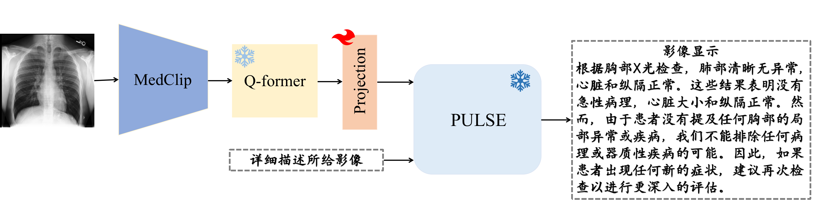

# [Model/Code] XrayPULSE

<!-- select Model and/or Data and/or Code as needed>

### Welcome to OpenMEDLab! 👋

<!--
**Here are some ideas to get you started:**
🙋‍♀️ A short introduction - what is your organization all about?
🌈 Contribution guidelines - how can the community get involved?
👩‍💻 Useful resources - where can the community find your docs? Is there anything else the community should know?
🍿 Fun facts - what does your team eat for breakfast?
🧙 Remember, you can do mighty things with the power of [Markdown](https://docs.github.com/github/writing-on-github/getting-started-with-writing-and-formatting-on-github/basic-writing-and-formatting-syntax)
-->

<!-- Insert the project banner here -->

<div align="center">
    <a href="https://"></a>
</div>


---

<!-- Select some of the point info, feel free to delete -->

Updated on 2023.06.21


## Key Features

This repository provides the official implementation of XrayPULSE: 

Key feature bulletin points here

- An attempt to extend [PULSE]() to a biomedical multimodal conversational assistant. 
- XrayPULSE is fintuned on Xray-Report paired datasets in Chinese

## Links

- [PULSE\_Model](https://) 
- [Pretrained_XrayPULSE_Checkpoint](https://)


<!-- give a introduction of your project -->

## Details

Our model is based onPULSE. We utilize [MedCLIP](https://github.com/RyanWangZf/MedCLIP)  as our medical visual encoder and Q-former ([BLIP2](https://huggingface.co/docs/transformers/main/model_doc/blip-2)) following a simple linear transformation as the adapter to inject the image to PULSE. For aligning the frozen visual encoder and the LLM by the adapter, we generate Chinese-version Xray-Report paired data from free-text radiology reports of two datasets ([MIMIC-CXR](https://physionet.org/content/mimic-cxr-jpg/2.0.0/) and [OpenI](https://openi.nlm.nih.gov/faq#collection)) with the help of chatGPT.  To facilitate research in biomedical multimodal learning, we will release the data to the public: the biomedical.

<!-- Insert a pipeline of your algorithm here if got one -->

<div align="center">
    <a href="https://"></a>
</div>


## Get Started

**Installation**

```bash
git clone https://github.com/openmedlab/XrayPULSE.git
cd XrayPLUSE
```

**Environment**

```bash
conda env create -f environment.yml
conda activate xraypulse
```

**Prepare the pretrained weights**

You can find the pretrained model weights.

- [PULSE\_Model](https://huggingface.co/OpenMEDLab/PULSE-7bv5) 
- [Pretrained_XrayPULSE_Checkpoint](https://)

The weights of PULSE would be in a single folder in a structure similar to the following:

```
pulse_weights
├── config.json
├── generation_config.json
├── tokenizer.json
├── tokenizer_config.json
├── special_tokens_map.json 
├── pytorch_model.bin.index.json
├── pytorch_model-00001-of-00002.bin
├── pytorch_model-00002-of-00002.bin 
```

Then, set the path of pulse_weights to "pulse_weights" in the model config file "xraypulse/configs/models/xraypulse.yaml"

And add the path of the pretrained checkpoint  in "demo_configs/xraypulse_demo.yaml".

**Run Demo**

```bash
bash run_demo.sh
```


## 🙏 Acknowledgement

- [MiniGPT-4](https://github.com/Vision-CAIR/MiniGPT-4)
- [MedCLIP](https://github.com/RyanWangZf/MedCLIP) 、[BLIP2](https://huggingface.co/docs/transformers/main/model_doc/blip-2) 、[XrayGPT](https://github.com/mbzuai-oryx/XrayGPT) 

## 📝 Citation

If you find this repository useful, please consider citing this paper:

```
@article{nobody,
  title={paper},
  author={nobody},
  journal={arXiv preprint arXiv:},
  year={2023}
}
```

## 🛡️ License

This project is under the CC-BY-NC 4.0 license. See [LICENSE](LICENSE) for details.
